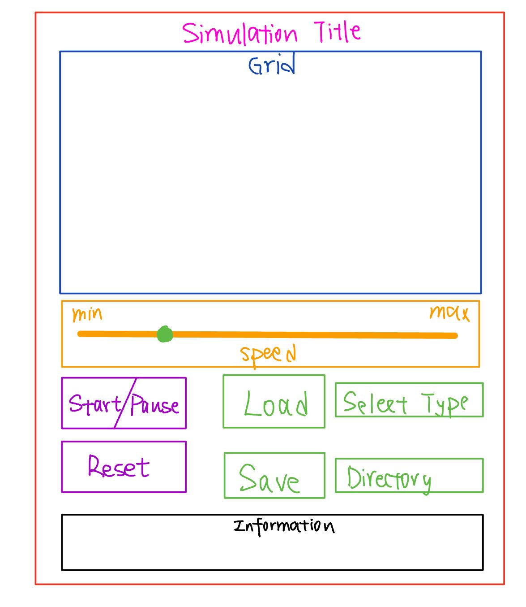
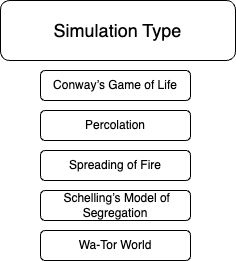
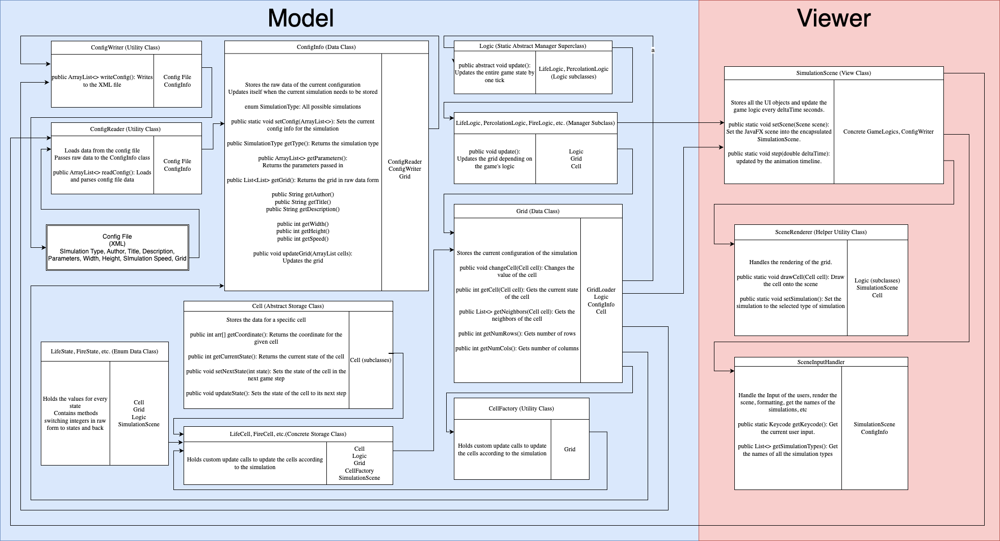

# Cell Society Design Plan

### Team Number 1

### Billy McCune wrm29, Jacob You jay27, Hsuan-Kai Liao hl475

---

## Overview

### Task

Write a program that can automate different kinds of Cellular Automata models, with features that allow users to change cells and adjust simulation speed and input.

### Primary Design Goals:
- **Extensibility**: It should be easy to add or remove different simulation types based on the common abstractions and design.
- **Encapsulation**: making implementations hidden and being able to change them without any external effects.
- **Abstraction**: using abstract classes for common classes to reduce redundancy and allow for variability.
- **Externalize** configuration to config files
- Implement **JUnit** testing to verify code

### Primary architecture:
**Closed**: Grid data structure, config files

**Open**: The layout of the simulation and its parameters

### Program description:
Have a JavaFX display of a grid with cells that run the simulation specified by config files. The user should be able to edit the simulation as it runs.

---

## User Interface

### Main Simulation Scene


### Title Scene (extra feature to implement if time)


## Configuration File Format
A simulation config file representing a glider in Game of Life
```xml
<simulation>
    <type>GameOfLife</type>
    <title>Glider Test</title>
    <author>Richard Guy</author>
    <description>A classic glider pattern in Game of Life.</description>
    <parameters>
    </parameters>
    <width>5</width>
    <height>5</height>
    <defaultSpeed>2</defaultSpeed>
    <initialStates>
        <row>0 0 1 0 0</row>
        <row>1 0 1 0 0</row>
        <row>0 1 1 0 0</row>
        <row>0 0 0 0 0</row>
        <row>0 0 0 0 0</row>
    </initialStates>
</simulation>
```

A simulation config file representing a fire in the top left corner for Spreading of Fire
```xml
<simulation>
    <type>SpreadingOfFire</type>
    <title>EdgeFire</title>
    <author>A Random Volcano</author>
    <description>A fire starts at the edge of the grid</description>
    <parameters>
        <probCatch>0.4</probCatch>
    </parameters>
    <width>6</width>
    <height>6</height>
    <defaultSpeed>3</defaultSpeed>
    <initialStates>
        <!-- 0: Empty, 1: Tree, 2: Burning-->
        <row>2 1 1 1 1 1</row>
        <row>1 1 1 1 1 1</row>
        <row>1 0 1 1 1 1</row>
        <row>1 1 1 1 1 1</row>
        <row>1 1 1 1 1 1</row>
        <row>1 1 1 1 1 1</row>
    </initialStates>
</simulation>
```

---

## Design Details
### UML Design of the Cell Society project


---

## Use Cases

### Configuration and Initialization

#### **ConfigReader → ConfigInfo**
ConfigReader reads configuration files and extracts necessary parameters (simulation type, grid size, simulation-specific parameters like probCatch for a Fire simulation).

#### **ConfigInfo → GridLoader → Grid**
GridLoader takes the populated ConfigInfo and initializes the Grid by creating and arranging Cell instances according to the configuration.

---

### Simulation Execution

#### **Logic → Grid → Cell**
The Logic subclass interacts with the Grid to access and update the states of individual Cell instances. For example, during each update cycle, Logic may iterate through all cells in the Grid to apply simulation rules.

#### **Grid → SceneHelper Classes (e.g., SceneRenderer)**
After the Grid is updated by the Logic, SceneHelper classes like SceneRenderer access the Grid’s Cells to represent the current state of the simulation to the user.

#### **ConfigInfo → SimulationScene**
The information of the current simulation is obtained from the ConfigInfo file and is shown on the screen inside the SimulationScene.

---

### Dynamic Simulation Management

#### **ConfigInfo / SimulationScene / SceneInputHandler / ConfigReader**
Before switching simulations, the SimulationScene gets all the simulation types in the ConfigInfo enum class, then the SceneInputHandler listens to the player’s selection input. Once selected, the SimulationScene passes the selected simulation type to the ConfigReader so it knows what configuration to read later on.

#### **ConfigReader / GridLoader / Logic Switching**
When switching simulations, ConfigReader reads a new configuration file, GridLoader initializes a new Grid, and the appropriate Logic subclass is instantiated based on the new simulation type.

---

### Adding New Simulation Types

#### **Abstraction via Logic Superclass**
The abstract Logic superclass defines that all simulation-specific logic must implement the `update()` method. This allows new simulations to be added by simply creating new subclasses that follow this.

#### **Minimal Impact on Existing Code**
Adding a new simulation type (e.g., PercolationLogic) requires creating a new subclass without modifying existing classes.

---

### Managing Resource Files and Configuration Parameters

#### **Centralized Configuration Management**
ConfigReader and ConfigInfo centralize the handling of resource files and configuration parameters, making it easier to manage and extend configuration options without spreading configuration logic across different classes.

#### **Flexible Parameter Handling**
Simulation-specific parameters (e.g., probCatch for Fire simulation) are stored in ConfigInfo and passed to the relevant Logic subclass, allowing easy adjustments and extensions of simulation behavior through configuration files.

---

### Separation of Concerns

#### **GridLoader Flexibility**
GridLoader can be extended to support various grid configurations or initialization patterns without altering the Grid or Cell classes.

#### **Grid Flexibility**
Grid can be changed to support any form of data structure that can find neighbors, as Grid can be passed and parsed as an ArrayList of Cell.

#### **Data Management vs. Logic Execution**
Grid and Cell handle data storage and retrieval, while Logic and its subclasses manage the execution of simulation rules. This separation ensures that changes in simulation logic do not affect data structures and vice versa.

#### **Modular Structure**
Each class has a well-defined responsibility, making the system easier to maintain. New features or simulations can be added by introducing new classes or extending existing ones without disrupting the overall architecture.

#### **Utility Classes**
Classes like ConfigWriter and ConfigReader encapsulate common functionalities that can be reused across different parts of the application, reducing code duplication and enhancing consistency.

---

### Independent Viewer Logic

#### **SimulationScene**
SimulationScene is the main class that handles the update from the animation timeline. It keeps running the game with a fixed frame rate and updates the grid with the tick speed chosen by the user.

#### **SceneInputHandler**
The InputHandler is the scene helper class that handles the input events from the users. This will handle different input events while having the same JavaFX UI objects.

#### **SceneRenderer**
The SceneRenderer is another scene helper class that renders the cells and other game elements onto the scene.

## Concrete Use Case Examples

### **Use Case A: Apply the Rules to a Middle Cell**

#### **Scenario:**
- Suppose we have a Grid with a cell at `row = 5, col = 5` (surrounded by 8 neighbors).
- We want to apply the standard **Game of Life** rules to see if that cell should die in the next generation.

#### **Flow of Calls:**
1. `SimulationScene` initiates `LifeLogic.update()`.
2. `LifeLogic.updateSingleCell(grid, row, col)` runs on each cell. *(Internal step in `LifeLogic.update()`)*
3. `grid.getNeighbors(row, col)` returns the list of up to 8 neighbor cells.
4. `LifeLogic.countAliveNeighbors()` calculates how many are alive. *(Internal step in `LifeLogic.update()`)*
5. Based on the count:
    - `0-1` neighbor → dies of loneliness.
    - `4+` neighbors → dies of overpopulation.
    - Otherwise, survives.
6. `cell.nextState = 0` or `1` based on the rules.
7. Cell gets updated, and when drawn, the new state is displayed.

---

### **Use Case B: Apply the Rules to an Edge Cell**

#### **Scenario:**
- A Cell is located at `row = 0, col = 5`.
- Some neighbors are missing because it’s on the **top edge** of the grid.

#### **Flow of Calls:**
1. `LifeLogic.update()` is called like in **Use Case A**.
2. `LifeLogic.updateSingleCell(grid, 0, 5)`.
3. `grid.getNeighbors(0, 5)` returns **fewer neighbors** (only up to 5 instead of 8).
4. `updateSingleCell` logic remains the same.

#### **Pseudocode:**
```java
public void updateSingleCell(Cell cell) {
    int aliveCount = 0;
    
    for (Cell neighbor : cell.getNeighbors()) {
        if (neighbor.getCurrentState() == 1) {
            aliveCount++;
        }
    }

    if (cell.getCurrentState() == 1) {
        if (aliveCount < 2 || aliveCount > 3) {
            cell.setNextState(0);
        } else {
            cell.setNextState(1);
        }
    } else {
        // Check for reproduction
        if (aliveCount == 3) {
            cell.setNextState(1);
        } else {
            cell.setNextState(0);
        }
    }
}
```

---

### **Use Case C: Move to the Next Generation**

#### **Flow of Calls:**
1. `SimulationScene` calls `update()` on `Logic`.
2. `Logic` runs through each cell, setting their **next state**.
3. `Logic` calls `grid.update()`.
4. `Grid` sets each cell to their **next state**.

#### **Pseudocode:**

#### **LifeLogic**
```java
public void update() {
    for (int row = 0; row < numRows; row++) {
        for (int col = 0; col < numCols; col++) {
            updateSingleCell(grid.getCell(row, col));
        }
    }
    grid.updateGrid();
}
```

#### **Grid**
```java
public void updateGrid() {
    for (List<Cell<T>> row : grid) {
        for (Cell<T> cell : row) {
            cell.update();
        }
    }
}
```

#### **Cell**
```java
public void update() {
    this.currState = this.nextState;
}
```

---

## **Use Case D: Switch Simulations**

### **Flow of Calls:**
1. Get all **simulation types** from `ConfigInfo`.
2. Get the **user’s input** and selected simulation type.
3. Pass the selected type to the `ConfigReader`.

### **Pseudocode:**

#### **Inside SimulationScene**
```java
public void setSimulationTypes() { 
    List<String> simulationTypes = configInfo.getSimulationTypes(); 
    dropdown.getItems().addAll(simulationTypes); 
} 

public void handleSelection() { 
    String selectedType = dropdown.getValue();

    if (selectedType != null) { 
        configReader.loadConfig(selectedType); 
    } else { 
        // Handle case where no simulation type is selected
    } 
}
```

---

### **Use Case E: Set a Simulation Parameter (e.g., Speed)**

#### **Flow of Calls:**
1. Get **value** from the **user’s input slider**.
2. Pass the value for the **update frequency**.
3. Update the **grid** based on the **new update frequency**.

#### **Pseudocode:**

#### **Instance method inside SimulationScene**
```java
private void setUpdateFrequency() {
    // Get the value from the user's input slider
    double updateFrequency = slider.getValue();
    this.updateFrequency = updateFrequency;
}
```

#### **Inside SimulationScene**
```java
public void step(double elapsedTime) { 
    double updateFrequency = slider.getValue(); 
    if (elapsedTime >= (1.0 / updateFrequency)) {  
        // Check if it's time to update based on the update frequency 
        grid.update();  
    }
}
```

## **Per Person Use Cases**

Method names and implementation in this section are solely for the logic, and sometimes may not represent the names and usages in actual implementation.

### **Person 1: Jacob You**

### **Use Case #1: Apply SpreadingOfFire Logic**

#### **Scenario:**
- Suppose we have a Grid with a cell at `row = 5, col = 5` (surrounded by 8 neighbors).
- We want to apply the **SpreadingOfFire** rules to see if that cell should catch on fire in the next step.

#### **Flow of Calls:**
1. `SimulationScene` initiates `FireLogic.update()`.
2. `FireLogic.updateSingleCell(cell)` runs on each cell *(private method in `FireLogic`)*.
3. `grid.getNeighbors(row, col)` returns the list of up to 8 neighbor cells.
4. `FireLogic.getTreeNeighbors()` calculates how many trees are alive.
5. Based on `probCatch`, if the cell is burning, set neighbor trees' next states to **on fire** randomly.
6. Cell gets updated, and when drawn, the cell is shown as its new state.

#### **Pseudocode:**
```java
public void updateSingleCell(Cell cell) {
    if (cell.getCurrentState() != 2) { // Not burning
        return;
    }
    for (Cell neighbor : cell.getNeighbors()) {
        if (random.nextDouble() < probCatch) {
            neighbor.setNextState(2); // Set neighbor on fire
        }
    }
}
```

---

### **Use Case #2: Apply WaTorWorld Logic**

#### **Scenario:**
- Suppose we have a Grid with a cell at `row = 5, col = 5` (surrounded by up to 8 neighbors).
- We want to apply the **Wa-Tor World** rules to see how this cell's organism (fish, shark, or empty) behaves in the next step.

#### **Flow of Calls:**
1. `SimulationScene` initiates `WaTorLogic.update()`.
2. `WaTorLogic.updateSingleCell(cell)` runs on each cell *(private method in `WaTorLogic`)*.
3. `grid.getNeighbors(row, col)` returns a list of up to 8 neighboring cells.
4. `WaTorLogic.getFishNeighbors()` or `WaTorLogic.getEmptyNeighbors()` filters neighbors to find specific targets.
5. If the cell is a:
    - **Shark**: Moves, eats fish, reproduces, or dies based on starvation.
    - **Fish**: Moves, reproduces, or remains in place if surrounded.
    - **Empty Space**: Remains empty.
6. Next states are set for each affected cell.
7. The grid updates all cells, and when drawn, the new states reflect the updated simulation.

#### **Pseudocode:**
```java
public void updateSingleCell(Cell cell) {
  // Methods named for sake of logic
    if (cell.isEmpty()) return;

    List<Cell> neighbors = grid.getNeighbors(cell);

    if (cell.isFish()) {
        List<Cell> emptyNeighbors = getEmptyNeighbors(neighbors);
        if (!emptyNeighbors.isEmpty()) {
            moveTo(emptyNeighbors.get(0));
        }
        if (cell.getReproductionCount() >= reproductionThreshold) {
            reproduce();
        }
        cell.incrementReproductionCount();
    }

    if (cell.isShark()) {
        List<Cell> fishNeighbors = getFishNeighbors(neighbors);
        if (!fishNeighbors.isEmpty()) {
            eatFish(fishNeighbors.get(0));
            cell.resetStarvationCount();
        } else {
            cell.incrementStarvationCount();
            if (cell.getStarvationCount() >= starvationThreshold) {
                cell.die();
                return;
            }
        }
        List<Cell> emptyNeighbors = getEmptyNeighbors(neighbors);
        if (!emptyNeighbors.isEmpty()) {
            moveTo(emptyNeighbors.get(0));
        }
        if (cell.getReproductionCount() >= reproductionThreshold) {
            reproduce();
        }
        cell.incrementReproductionCount();
    }
}

grid.updateGrid();
```

---

### **Person 2: Billy McCune**

### **Use Case #1: Load and Distribute Data from Config File**

#### **Flow of Calls:**
1. The simulation calls the `ReadConfig` class and uses the `loadFile()` method.
2. `loadFile()` retrieves data from the **config file** and passes it to `ConfigInfo`.
3. `ConfigInfo` stores the extracted data in the appropriate instance variables.

#### **Pseudocode:**

```java
// In ConfigReader
public ArrayList<String> readConfig(String simulationType) {
    String fileName = getFileName(simulationType);
    File dataFile = new File(fileName);
    
    if (!checkData(dataFile)) {
        throw new IllegalArgumentException("Invalid config file");
    }

    return formatData(dataFile);
}
```

---

### **Use Case #2: Write the Config Data to Save the Current Simulation**

#### **Flow of Calls:**
1. Call `SimulationScene` to get the **current simulation settings**.
2. Gather the information and store it in the correct order.
3. Write the data to a save XML file using the **structure used by the reader**.

#### **Pseudocode:**

```java
// In ConfigWriter
public void writeConfig() {
    String data = getData();
    String saveName = createSaveName();
    data.append(saveName);

    Document document = getDocument();
    document.addData(data);
}
```

---

### **Person 3: Hsuan-Kai Liao**

### **Use Case #1: Render the Grid from the Cell**

#### **Flow of Calls:**
1. Get the **width and height** from `ConfigInfo`.
2. Get the **cell data** from `Grid`.
3. Render each cell accordingly.

#### **Pseudocode:**

```java
public void render(GraphicsContext gc) { 
    int width = configInfo.getWidth(); 
    int height = configInfo.getHeight(); 
    int cellSize = 20; 

    for (Cell cell : grid.getCells()) { 
        int[] coordinate = cell.getCoordinate(); 
        int x = coordinate[0]; 
        int y = coordinate[1]; 
        int state = cell.getCurrentState(); 

        Color color = getColorFromState(state);

        gc.setFill(color); 
        gc.fillRect(x * cellSize, y * cellSize, cellSize, cellSize);
    }
}
```

---

### **Use Case #2: Show the Current Simulation Info to the User**

#### **Flow of Calls:**
1. Get **simulation info** from `ConfigInfo`.
2. Get the **speed** from the **current UI widget**.
3. Set the simulation info to the UI widget.

#### **Pseudocode:**

```java
// Inside SceneRenderer
public void renderSimulationInfo() { 
    // Get simulation info from ConfigInfo 
    String simulationTitle = ConfigInfo.getTitle(); 
    String simulationDescription = ConfigInfo.getDescription();

    // Get the speed from the UI slider
    double simulationSpeed = slider.getValue(); 

    // Set the UI widgets with the retrieved simulation info
    Label.setText("Title: " + simulationTitle + "\nDescription: " + simulationDescription + "\nSpeed: " + simulationSpeed); 
}
```

---

## Design Considerations

### **Cell (Abstract Storage Class)**
#### **Responsibility:**
- Stores the current state of a single location in the grid (e.g., alive/dead, burning/not burning, fish/shark/empty in Wa-Tor).
- Maintains a “next state” assigned during each simulation step.
- Provides row/column for identifying its position.
- Offers basic getters/setters

#### **Why We Chose This Approach:**
- Keeps cell-related logic minimal and contained.
- Encourages single responsibility: A `Cell` only knows about its data, not how neighbors affect it.
- Implementation Flexibility:
    - We can create multiple subclasses (`LifeCell`, `PercolationCell`, etc.) for specialized behavior or internal fields.
- Enum State:
    - By making `Cell<T extends Enum<T>>`, each cell is tied to a specific simulation’s states while remaining type-safe.

---

### **CellFactory (Abstract Utility Class)**
#### **Responsibility:**
- Quickly creates Cells of a certain type, as each cell is tied to the specific simulation.

#### **Why We Chose This Approach:**
- Encapsulates cell creation into a dedicated section.
- Ties cells to specific simulations, making the system modular.

---

### **Logic (Abstract Manager Superclass)**
#### **Responsibility:**
- Provides an `update()` method that computes the next state of all cells in the grid.
- Subclasses (`LifeLogic`, `FireLogic`, `PercolationLogic`, `WaTorLogic`, etc.) implement unique rules.

#### **Why We Chose This Approach:**
- Polymorphism: Each simulation has different rules but shares a common interface (`update()` method).
- Avoids Large Classes:
    - Each simulation’s logic is separated into its own subclass, making code organized and maintainable.
- Enum Usage:
    - Each subclass uses a specific `T extends Enum<T>` to handle states with minimal casting.

---

### **Grid (Data Class)**
#### **Responsibility:**
- Stores a 2D list (or another data structure) of `Cell<T>` objects.
- Provides methods to retrieve neighbors (e.g., `getNeighbors(cell)`) and handle boundary conditions.
- Acts as the “board” where the simulation occurs.

#### **Why We Chose This Approach:**
- Centralizes Data:
    - The logic classes only need to ask the Grid for neighbors instead of dealing with storage details.
- Simplifies Logic:
    - Simulation rules only read/write Cell states, without worrying about array indexing.
- Flexible Storage Method:
    - We can swap out the internal storage (2D list, 1D list, etc.) without affecting how logic classes or cells function.

---

### **LifeState, PercolationState, etc. (Enums)**
#### **Responsibility:**
- Stores the possible states for different simulations.
- Converts integer-encoded states from config files into Java objects.

#### **Why We Chose This Approach:**
- Eliminates "magic variables" by strictly defining states in separate classes.
- Encapsulation: Adding new states becomes easy and structured.

---

### **SimulationScene, InputHandler, SceneRenderer**
#### **Responsibility:**
- Stores all UI elements and keeps them separate from the model.
- Handles user input and manages related events.
- Renders the scene using model inputs.

#### **Why We Chose This Approach:**
- Separates UI and input handling from the grid-cell models.
- Centralized UI management:
    - Formatting UI widgets is easier when they are all in one file.
- Simplifies rendering and maintains clarity.

---

### **ConfigReader, ConfigWriter, ConfigInfo**
#### **Responsibility:**
- Manages interactions with configuration files.
- Handles saving and loading configurations.
- Stores information about the current configuration.

#### **Why We Chose This Approach:**
- Abstracts configuration files away from the inner model and viewer.
- Encapsulates logic, making it easier to develop other classes without worrying about config file details.
- Separation of `ConfigReader` and `ConfigInfo` makes the code more readable.

---

### **Design Issues**
This section describes two key design issues our group discussed at length, outlining the pros and cons of different approaches and detailing the final decision made for each issue.

### **Design Issue #1: Switching Simulations**
Switching between different simulation types is a critical feature of our application, allowing users to seamlessly transition from one simulation environment to another.

#### **Approach 1: Config File-Based Switching**
When the user opts to switch simulations, they select a configuration file corresponding to the desired simulation type. The application then loads the entire simulation based on the simulation type specified within the chosen config file.

#### **Pros:**
- **Simplified User Interaction:**
    - Minimal User Decisions: Users don’t have to manually select the simulation type; the system automatically determines it from the config file.
- **Ease of Implementation:**
    - Straightforward Development: This approach leverages existing configuration management mechanisms, reducing implementation complexity.
    - Reduced UI Overhead: No need to design new UI elements (e.g., tabs or selection dialogs) for simulation switching.
- **Flexibility in Configuration:**
    - Extensible Simulation Definitions: New simulations can be added easily by simply introducing new config files, without modifying the core codebase.

#### **Cons:**
- **Limited User Control:**
    - Indirect Simulation Selection: Users must navigate config files externally, which may be unintuitive, especially for non-technical users.
- **Less Interactive Experience:**
    - Static Switching Mechanism: The absence of a dynamic selection interface may result in a less engaging user experience.
    - Lack of Previews: Users cannot preview or explore available simulations interactively.

#### **Approach 2: Interactive Simulation Selection via UI Tabs**
Implement a user interface feature (e.g., a tabbed panel or popup dialog) listing all available simulation types. Users can directly select their desired simulation from this list. Upon selection, the application loads a default configuration for that simulation, while still allowing users to load custom config files.

#### **Pros:**
- **Greater User Control:**
    - Direct Selection: Users explicitly choose their simulation, rather than guessing based on filenames.
- **Scalability and Organization:**
    - Organized Simulation Management: A centralized UI makes it easier to navigate and discover available simulations, especially as the number of simulation types grows.
- **Enhanced User Experience:**
    - More Intuitive: The interactive selection process makes switching easier and more engaging.

#### **Cons:**
- **Increased Implementation Complexity:**
    - Additional Development Effort: Designing and integrating UI components (tabs, dialogs) requires extra development time and resources.
- **Maintenance Overhead:**
    - UI Synchronization: The system must ensure the UI accurately reflects available simulations when new ones are added or removed.
- **Potential Redundancy:**
    - Duplication of Configurations: Managing both UI selections and config files may introduce redundancy, requiring mechanisms to ensure consistency.

### **Final Decision:**
We opted for **Approach 2** (Interactive UI Selection).  
It improves the overall user experience and provides a robust framework for managing multiple simulations. To mitigate its cons, we plan to implement automated synchronization between the UI and config files to ensure consistency and reduce maintenance effort.

---

### **Design Issue #2: How to Save Simulations**
A crucial feature of our application is allowing users to save and load simulations.  
We debated two primary approaches for saving simulation states.

#### **Approach 1: Creating New Save XML Files**
Each saved simulation would generate a new configuration file, completely separate from the default configurations.

#### **Pros:**
- **Isolation:**
    - Each saved simulation is completely independent, preventing data corruption across simulations.
- **Familiarity:**
    - The same parser can be used for both saved and default configurations, making it simpler to maintain.

#### **Cons:**
- **File System Bloat:**
    - Too many files: Each save creates a new file, which could clutter the file system after many saves.
- **Implementation Challenges:**
    - Creating new files dynamically could introduce file permission issues and potential conflicts in shared environments.

### **Approach 2: Using a Single Save File**
Instead of creating a new file for each save, a single XML file would store all saved simulations.

#### **Pros:**
- **Easier Implementation:**
    - Appending data to a single file is simpler than creating new files dynamically.
- **Better Management:**
    - Centralized storage makes it easier to list, retrieve, and manage saved simulations.

#### **Cons:**
- **Parsing Complexity:**
    - The saved configurations may have a different structure than the default configs, requiring a more complex parser.
- **Potential Project Guideline Issues:**
    - Depending on project requirements, having a single file for multiple simulations may violate guidelines about modular file structure.
- **Scalability Concerns:**
    - The size of a single file could grow significantly, leading to longer parsing times.

### **Final Decision**
We opted for Approach 1 (New XML Files for Each Save).
It prevents corruption and keeps each save fully independent. It aligns better with project goals by keeping file-based storage intuitive.
However, we acknowledge that file system clutter is a concern, and in the future, a hybrid solution (e.g., JSON-based index for saved configurations) may be worth considering.

---

## **Team Responsibilities**

### **Team Member #1: Jacob You**

#### **Primary Responsibilities:**
- Logic Class
- Grid Class
- Cell Class
- Cell Factory Class
- State Enum Classes

#### **Secondary Responsibilities:**
- Write different **cellular automata logics**
- Help with **UI implementation** when available

---

### **Team Member #2: Billy McCune**

#### **Primary Responsibilities:**
- XML File Management
- ConfigInfo Class
- ConfigReader Class
- ConfigWriter Class

#### **Secondary Responsibilities:**
- Implement **Logic sub-classes**
- Assist with **UI development**

---

### **Team Member #3: Hsuan-Kai Liao**

#### **Primary Responsibilities:**
- UI Scene
- Simulation Scene
- InputHandler
- Scene Renderer

#### **Secondary Responsibilities:**
- Work on **linking methods** between UI objects and game logic  